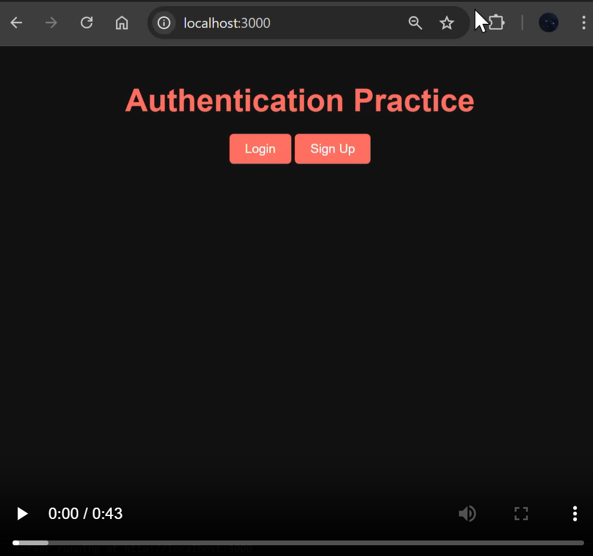

# 🔐 Express Auth Dashboard

A clean, dark-themed user authentication system built with **Express.js**, featuring **login**, **signup**, **role-based access control**, and a **simple admin dashboard** with session support.

## ✨ Features

- Secure password hashing with **bcrypt**
- Express **session-based authentication**
- Role-based dashboard (Admin/User)
- Persistent UI feedback (success/error messages)
- Stylish dark-themed frontend (CSS only)
- Login via **email** or **username**
- Real-time **CLI-style activity logs** for users

---

## 🚀 Demo

### 📸 Screenshots

### Admin Dashboard

> View all registered users in a table with a sleek, dark interface.


---

### 🎥 Video Walkthrough

> Quick visual guide of the full login → dashboard → logout flow.

[](./demo.mp4)

> Click image above or [watch video](./demo.mp4)

---

## 🧠 How It Works

### Login Flow

1. User logs in with **email or username**
2. Credentials are validated using **bcrypt**
3. Upon success:
   - Session is stored
   - User is redirected to `/landing`
4. Admins see a user list; regular users see a friendly message

---

## 🛠️ Tech Stack

- **Express.js**
- **EJS** (Embedded JavaScript Templates)
- **bcrypt**
- **express-session**
- **HTML/CSS**

---

## 📁 File Structure (Highlights)

```text
.
├── index.js                 # Main server logic
├── views/                  # EJS templates
│   ├── login.ejs
│   ├── signup.ejs
│   ├── landing.ejs
│   └── partials/
├── public/
│   └── styles.css          # Custom dark theme
├── demo1.png
├── demo2.png
├── demo.mp4
└── README.md
```

---

## 🔧 Setup & Run

```bash
git clone https://github.com/davehusk/express-auth-dashboard.git
cd express-auth-dashboard
npm install
node index.js
```

Then visit: [http://localhost:3000](http://localhost:3000)

---

## 🛡️ Security Notes

- Passwords are hashed using **bcrypt**
- Sessions are securely handled via **express-session**
- Admins only access user list (RBAC enforced in `/landing` route)

---

## ❤️ Author

Crafted with care and intention.  
Let every route be a decision, every view a reflection.  
🔗 Stay curious. By David Husk

---
